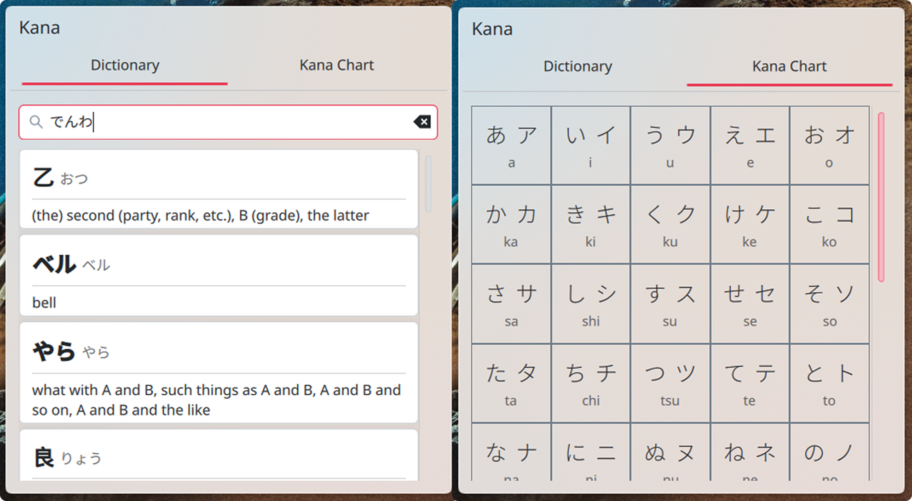

<h1 align="center">

<br/>
Kana
</h1>

<p align="center">A KDE system tray widget designed for Japanese learners.</p>



## Features

* **Dictionary Search** Search words using Hiragana / Katanaka / Kanji / Romaji. Uses the unofficial jisho.org API.
* **Kana Chart:** A table for Hiragana and Katakana with Romaji.

## Prerequisites
* **KDE Plasma 6**
* **Qt 6** / **Kirigami**
  
## Installation

### Option 1: Plasmoid file
* Download the .plasmoid file.
* Right-click on your desktop and select "Enter Edit Mode".
* Click "Add or Manage Widgets..." then "Get New..." and finally "Install Widget From Local File..."
* Select the downloaded .plasmoid file.

### Option 2: Command Line
Navigate to the downloaded folder (repo) and run the following command to install the widget to your local user directory:
```bash
kpackagetool6 -i package --type Plasma/Applet

